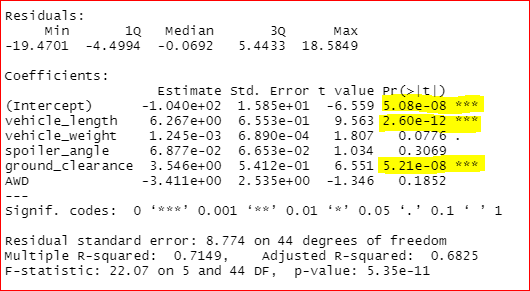
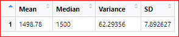
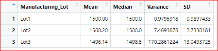
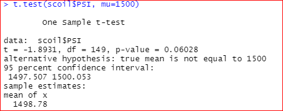
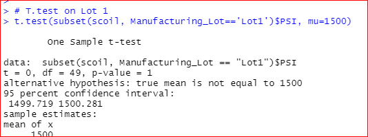
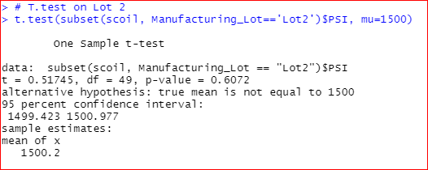
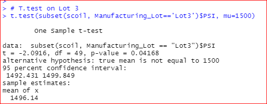

# MechaCar_Statistical_Analysis

## Linear Regression to Predict MPG:
* Which variables/coefficients provided a non-random amount of variance to the mpg values in the dataset?

The summary output, each Pr(>|t|) value represents the probability that each coefficient contributes a random amount of variance to the linear model.
According to our results, vehicle length and ground_clearance (as well as intercept) are statistically unlikely to provide random amounts of variance to the linear model. In other words the vehicle length and ground_clearance have a significant impact on quarter-mile race time

* Is the slope of the linear model considered to be zero? Why or why not?
The intercept is statiscally significant ( less tha .05) and not zero.

* Does this linear model predict mpg of MechaCar prototypes effectively? Why or why not?
The multiple r-squared value is .71 indicationg the model does good job of predicting the mpg.

## Summary Statistics on Suspension Coils:
 *  Does the current manufacturing data meet this design specification for all manufacturing lots in total and each lot individually? Why or why not?

 

 The design specifications for the MechaCar suspension coils dictate that the variance of the suspension coils must not exceed 100 pounds per square inch. 
 Yes it meets the specification as the variance is less than 100.
 
 

 For Lot 1 & Lot 2 it meets the specification as the variance is less than 100. Lot 3 doesn't meet the specification as the variance is gtreater than 100. 

## T-Tests on Suspension Coils 
All lots a re significantly different from mean (p-valoe is .06 )

For Lot 1 we fail to reject null hypothesis as p- value is greater than the significance value( p- value =1)

For Lot 2 we fail to reject null hypothesis as p- value is greater than the significance value( p- value =.6)

For Lot 3 we reject null hypothesis as p- value is less than the significance value( p- value =.04)

## Study Design: MechaCar vs Competition
* A statistical study to compare performance of the MechaCar vehicles against performance of vehicles from other manufacturers. Can compare the maintainence cost, fuel efficiency of the cars

* Null Hypothesis : The difference between our paired observations (the true mean difference, or "μd") is equal to zero.
* Alternate Hypothesis : The difference between our paired observations (the true mean difference, or "μd") is not equal to zero.
* Perform paired t.Test.
* From the p-value ( from data of the t.Test), we can either reject or fail to reject the null hypothesis.
